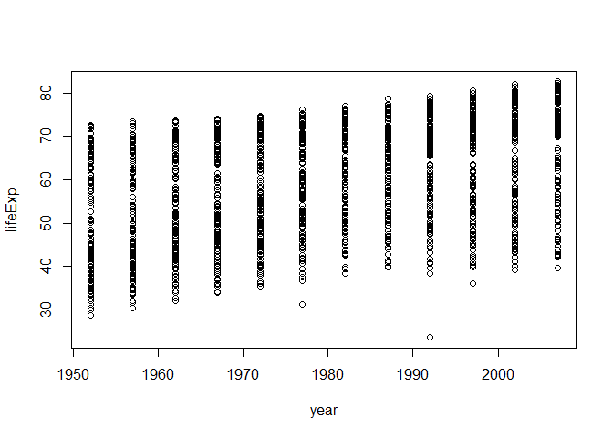
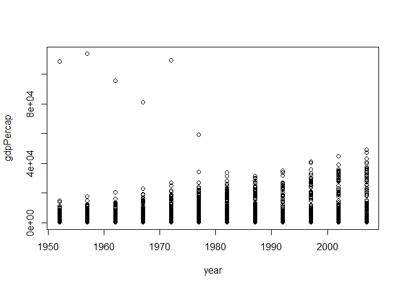
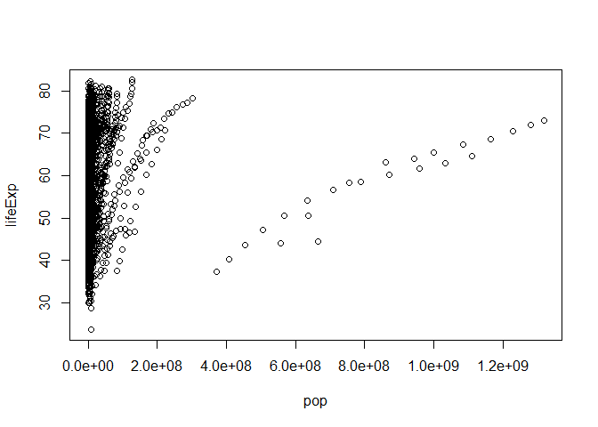
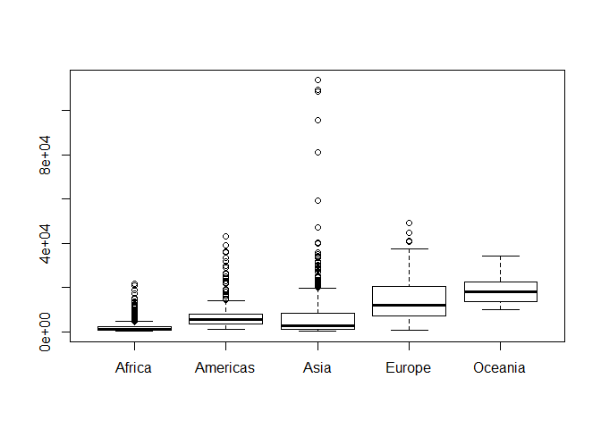

hw01\_gapminder
================
sdhanani
September 15, 2017

``` r
library(tidyverse)
```

    ## Warning: package 'tidyverse' was built under R version 3.4.1

    ## Loading tidyverse: ggplot2
    ## Loading tidyverse: tibble
    ## Loading tidyverse: tidyr
    ## Loading tidyverse: readr
    ## Loading tidyverse: purrr
    ## Loading tidyverse: dplyr

    ## Warning: package 'tibble' was built under R version 3.4.1

    ## Warning: package 'tidyr' was built under R version 3.4.1

    ## Warning: package 'purrr' was built under R version 3.4.1

    ## Warning: package 'dplyr' was built under R version 3.4.1

    ## Conflicts with tidy packages ----------------------------------------------

    ## filter(): dplyr, stats
    ## lag():    dplyr, stats

``` r
library(gapminder)
```

    ## Warning: package 'gapminder' was built under R version 3.4.1

``` r
str(gapminder)
```

    ## Classes 'tbl_df', 'tbl' and 'data.frame':    1704 obs. of  6 variables:
    ##  $ country  : Factor w/ 142 levels "Afghanistan",..: 1 1 1 1 1 1 1 1 1 1 ...
    ##  $ continent: Factor w/ 5 levels "Africa","Americas",..: 3 3 3 3 3 3 3 3 3 3 ...
    ##  $ year     : int  1952 1957 1962 1967 1972 1977 1982 1987 1992 1997 ...
    ##  $ lifeExp  : num  28.8 30.3 32 34 36.1 ...
    ##  $ pop      : int  8425333 9240934 10267083 11537966 13079460 14880372 12881816 13867957 16317921 22227415 ...
    ##  $ gdpPercap: num  779 821 853 836 740 ...

``` r
head(gapminder)
```

    ## # A tibble: 6 x 6
    ##       country continent  year lifeExp      pop gdpPercap
    ##        <fctr>    <fctr> <int>   <dbl>    <int>     <dbl>
    ## 1 Afghanistan      Asia  1952  28.801  8425333  779.4453
    ## 2 Afghanistan      Asia  1957  30.332  9240934  820.8530
    ## 3 Afghanistan      Asia  1962  31.997 10267083  853.1007
    ## 4 Afghanistan      Asia  1967  34.020 11537966  836.1971
    ## 5 Afghanistan      Asia  1972  36.088 13079460  739.9811
    ## 6 Afghanistan      Asia  1977  38.438 14880372  786.1134

``` r
nrow(gapminder)
```

    ## [1] 1704

``` r
ncol(gapminder)
```

    ## [1] 6

Now we've loaded the packages and took intial looks at the data through thet structure and the top 6 rows of the data. Inspected the data and found the number of rows and columns.

Would be curious to see what the range of the numeric values are:

``` r
range(gapminder$year)
```

    ## [1] 1952 2007

``` r
range(gapminder$lifeExp)
```

    ## [1] 23.599 82.603

``` r
range(gapminder$pop)
```

    ## [1]      60011 1318683096

``` r
range(gapminder$gdpPercap)
```

    ## [1]    241.1659 113523.1329

Want to see general summary of all the variables in the gapminder dataset:

``` r
summary(gapminder$country)
```

    ##              Afghanistan                  Albania                  Algeria 
    ##                       12                       12                       12 
    ##                   Angola                Argentina                Australia 
    ##                       12                       12                       12 
    ##                  Austria                  Bahrain               Bangladesh 
    ##                       12                       12                       12 
    ##                  Belgium                    Benin                  Bolivia 
    ##                       12                       12                       12 
    ##   Bosnia and Herzegovina                 Botswana                   Brazil 
    ##                       12                       12                       12 
    ##                 Bulgaria             Burkina Faso                  Burundi 
    ##                       12                       12                       12 
    ##                 Cambodia                 Cameroon                   Canada 
    ##                       12                       12                       12 
    ## Central African Republic                     Chad                    Chile 
    ##                       12                       12                       12 
    ##                    China                 Colombia                  Comoros 
    ##                       12                       12                       12 
    ##         Congo, Dem. Rep.              Congo, Rep.               Costa Rica 
    ##                       12                       12                       12 
    ##            Cote d'Ivoire                  Croatia                     Cuba 
    ##                       12                       12                       12 
    ##           Czech Republic                  Denmark                 Djibouti 
    ##                       12                       12                       12 
    ##       Dominican Republic                  Ecuador                    Egypt 
    ##                       12                       12                       12 
    ##              El Salvador        Equatorial Guinea                  Eritrea 
    ##                       12                       12                       12 
    ##                 Ethiopia                  Finland                   France 
    ##                       12                       12                       12 
    ##                    Gabon                   Gambia                  Germany 
    ##                       12                       12                       12 
    ##                    Ghana                   Greece                Guatemala 
    ##                       12                       12                       12 
    ##                   Guinea            Guinea-Bissau                    Haiti 
    ##                       12                       12                       12 
    ##                 Honduras         Hong Kong, China                  Hungary 
    ##                       12                       12                       12 
    ##                  Iceland                    India                Indonesia 
    ##                       12                       12                       12 
    ##                     Iran                     Iraq                  Ireland 
    ##                       12                       12                       12 
    ##                   Israel                    Italy                  Jamaica 
    ##                       12                       12                       12 
    ##                    Japan                   Jordan                    Kenya 
    ##                       12                       12                       12 
    ##         Korea, Dem. Rep.              Korea, Rep.                   Kuwait 
    ##                       12                       12                       12 
    ##                  Lebanon                  Lesotho                  Liberia 
    ##                       12                       12                       12 
    ##                    Libya               Madagascar                   Malawi 
    ##                       12                       12                       12 
    ##                 Malaysia                     Mali               Mauritania 
    ##                       12                       12                       12 
    ##                Mauritius                   Mexico                 Mongolia 
    ##                       12                       12                       12 
    ##               Montenegro                  Morocco               Mozambique 
    ##                       12                       12                       12 
    ##                  Myanmar                  Namibia                    Nepal 
    ##                       12                       12                       12 
    ##              Netherlands              New Zealand                Nicaragua 
    ##                       12                       12                       12 
    ##                    Niger                  Nigeria                   Norway 
    ##                       12                       12                       12 
    ##                     Oman                 Pakistan                   Panama 
    ##                       12                       12                       12 
    ##                  (Other) 
    ##                      516

``` r
summary(gapminder$continent)
```

    ##   Africa Americas     Asia   Europe  Oceania 
    ##      624      300      396      360       24

``` r
summary(gapminder$year)
```

    ##    Min. 1st Qu.  Median    Mean 3rd Qu.    Max. 
    ##    1952    1966    1980    1980    1993    2007

``` r
summary(gapminder$lifeExp)
```

    ##    Min. 1st Qu.  Median    Mean 3rd Qu.    Max. 
    ##   23.60   48.20   60.71   59.47   70.85   82.60

``` r
summary(gapminder$pop)
```

    ##      Min.   1st Qu.    Median      Mean   3rd Qu.      Max. 
    ## 6.001e+04 2.794e+06 7.024e+06 2.960e+07 1.959e+07 1.319e+09

``` r
summary(gapminder$gdpPercap)
```

    ##     Min.  1st Qu.   Median     Mean  3rd Qu.     Max. 
    ##    241.2   1202.1   3531.8   7215.3   9325.5 113523.1

Some preliminary plotting of numeric variables

``` r
plot(lifeExp~year, data=gapminder)
```



``` r
plot(gdpPercap~year, gapminder)
```



``` r
plot(lifeExp~pop, gapminder)
```



Some plots of numeric and categorical variables

``` r
boxplot(lifeExp~continent, gapminder)
```


``` r
boxplot(gdpPercap~continent, gapminder)
```


